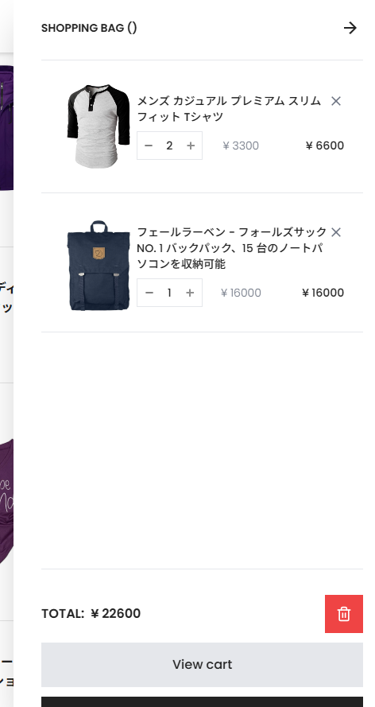

# 🛍 EC-SHOP（React製 シンプルECサイト）

## 🔍 概要
このアプリは、React と Tailwind CSS を用いて構築されたシンプルな EC サイトです。  
擬似的なバックエンド API（Node.js + Express）を用意し、商品一覧の取得や詳細表示、カート操作などの基本機能を実装しています。  
SPA（Single Page Application）として、UIとUXの両立を意識した設計になっています。

---
## 🛠 使用技術
- React（Hooks）
- React Context API（カート状態管理）
- Tailwind CSS（スタイリング）
- Node.js + Express（APIサーバー構築）
- JSONデータベース（商品データ管理）
- Git / GitHub（バージョン管理）

---
## ✨ 主な機能
- 商品一覧の取得（擬似API連携）
- 商品詳細ページへの遷移
- 商品をカートに追加／削除
- サイドバーによるカート操作（数量調整・合計計算）
- 状態管理は Context API で一元管理

---
## 📷 スクリーンショット

### 🛍 商品一覧ページ


### 🧺 カート（サイドバー）表示


### 🔍 商品詳細ページ


---
## 📂 ディレクトリ構成（抜粋）
```
EC-SHOP/ 
├── APIserver/ # 擬似APIサーバー 
│ ├── data.json 
│ └── index.js 
├── public/ 
│ └── logo.png など 
├── src/ 
│ ├── components/ # UI部品群 
│ ├── contexts/ # 状態管理 
│ ├── pages/ # ページ定義 
│ ├── img/ 
│ ├── App.jsx 
│ └── index.js 
├── tailwind.config.js 
└── README.md
```

---
## 💻 開発環境での起動方法

### 【APIサーバー（Node.js + Express）】
```bash
cd APIserver
npm install
npm run dev
```
→ http://localhost:3000/api/products にて商品一覧が取得可能<br>
※ nodemon を使用しており、開発中は保存時に自動で再起動されます。

### 【フロントエンド（React側）】
```bash
cd EC-SHOP
npm install
npm start
```
→ http://localhost:3001 でアプリを確認できます<br>
※ CORS設定済み。APIとReactアプリは別ポートで連携しています。

---
## 🧪 今後の拡張案
- 商品カテゴリによるフィルタリング機能
- 検索バーの追加
- ユーザー認証（ログイン／登録）
- 決済機能（仮想）
- 管理者用のダッシュボード機能

---
## 🙌 制作メモ
このアプリは職業訓練校での学習成果として制作しました。
React のコンポーネント構成や状態管理の仕組み、Tailwind によるUIデザイン、
さらにバックエンドAPIの導入を通じて、Webアプリ開発の一連の流れを実践的に学習しています。

---
## 📝 更新履歴
- 2025/04/11：初回コミット（`node_modules` 除去済み）
- 2025/04/11：ECサイト完成版に更新（商品一覧・詳細・カート機能）
- 2025/04/11：README.md 初版作成
- 2025/04/16：README.mdを全面改訂（構成整理・API構成・スクリーンショット追加）、`nodemon`導入、`.gitignore`を実践的に整理
- 2025/04/16：APIserver をサブモジュールから通常ディレクトリに再構成<br>
（.git 削除 → Git再初期化 → ECリポジトリに統合）

